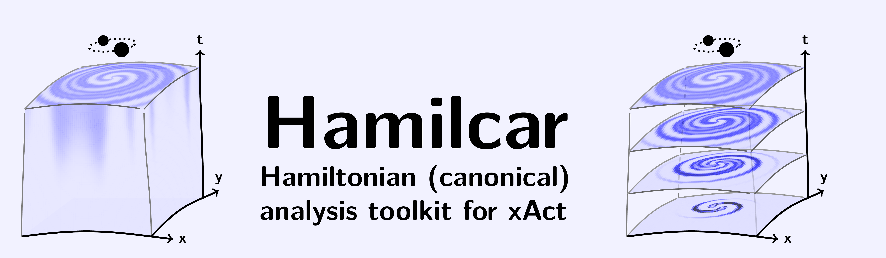

[](https://arxiv.org/abs/2512.25007)
[](https://arxiv.org/abs/2512.25007)



# Hamiltonian (canonical) analysis toolkit for _xAct_
## Version 0.0.0-developer

- Admits arbitrary tensorial field theories in 3+1 dimensions.
- Admits field theory on flat spacetime, or a dynamical metric for gravity.
- Keeps track of canonical fields and their conjugate momenta.
- Computes Poisson brackets between canonical quantities.
- Re-expresses computed brackets in terms of index-free ansätze using integrations by parts and dimensionally dependent identities.
- Can be used by humans.
- Can be used by agents.

## License

Copyright © 2023 Will E. V. Barker

_Hamilcar_ is distributed as free software under the [GNU General Public License (GPL)](https://www.gnu.org/licenses/gpl-3.0.en.html).

_Hamilcar_ is provided without warranty, or the implied warranty of merchantibility or fitness for a particular purpose.

If _Hamilcar_ was useful to your research, please **cite us** using the following _BibTeX_:
```tex
@article{Barker:2025noc,
    author = "Barker, Will",
    title = "{Fast Poisson brackets and constraint algebras in canonical gravity}",
    eprint = "2512.25007",
    archivePrefix = "arXiv",
    primaryClass = "physics.comp-ph",
    month = "12",
    year = "2025"
}
```

## About

_Hamilcar_ is a software package for _Wolfram_ (formerly _Mathematica_) designed to provide robust tools for agentic systems to perform Hamiltonian analysis in canonical field theory. The overall goal is to enable AI agents and automated systems to conduct sophisticated field theory calculations through well-defined interfaces.

The package focuses on canonical field theory calculations in 3+1 dimensions, where the action $S$ has the structure
```math
S=\int\mathrm{d}t\int\mathrm{d}^3x\ \Big[\pi_\psi(x,t)\cdot\dot{\psi}(x,t)-H(\psi,\pi_\psi)\Big],
```
where the ingredients are:
- The dynamical fields $\psi(x,t)$ are real tensors on the spatial manifold, which may be a collection of distinct fields, each field having some collection of spatial indices ($a$, $b$, etc.), perhaps with some symmetry among the indices.
- The conjugate momenta $\pi_\psi(x,t)$ are the canonical momenta conjugate to the fields $\psi(x,t)$.
- The Hamiltonian density $H(\psi,\pi_\psi)$ is constructed from the fields, momenta, spatial metric, and spatial derivatives.

## Example: scalar field theory

As a demonstration, we consider a simple scalar field theory in 3+1 dimensions
```math
S=\int\mathrm{d}^4x\ \Big[-\tfrac{1}{2}\partial^\mu\phi\partial_\mu\phi+\tfrac{1}{2}m^2\phi^2\Big],
```
where $m$ is the mass parameter.

In a fresh notebook we first load the package:
```mathematica
<<xAct`Hamilcar`;
```
Next, we define a scalar field using the command `DefCanonicalField`:
```mathematica
DefCanonicalField[Phi[],FieldSymbol->"\[Phi]",MomentumSymbol->"\[Pi]"];
```
We can then compute Poisson brackets between quantities:
```mathematica
PoissonBracket[Phi[],ConjugateMomentumPhi[]];
```

## Documentation 

Comprehensive documentation with worked examples is available as an interactive Mathematica notebook at `xAct/Hamilcar/Documentation/English/Documentation.nb`. This documentation includes:

- **General Relativity**: Complete walkthrough of the ADM formalism, including constraint definitions, smearing functions, and computation of the Dirac hypersurface deformation algebra
- **Maxwell Theory**: Canonical electromagnetic field theory demonstrating Gauss constraint analysis and the Dirac algorithm

To access the documentation, open the notebook file in Mathematica:
```mathematica
NotebookOpen["xAct/Hamilcar/Documentation/English/Documentation.nb"]
```

This provides an interactive notebook with all calculations, explanations, and mathematical results ready to execute.

## Agentic Integration

While _Hamilcar_ currently provides a comprehensive _Mathematica_ interface for canonical field theory calculations, it is intended for integration with agentic systems. A rudimentary agent [_Hasdrubal_](https://github.com/wevbarker/Hasdrubal) is under development.

## General use 

### Pre-defined geometry

When you first run `` <<xAct`Hamilcar` `` the software defines a three-dimensional spatial hypersurface with the ingredients:

| _Wolfram Language_      | Output format                    | Meaning                                                                                     |
|-------------------------|----------------------------------|---------------------------------------------------------------------------------------------|
| `a`, `b`, `c`, ..., `z` | $a$, $b$, $c$, ... $z$           | Spatial coordinate indices (corresponding to _adapted_ coordinates in the ADM prescription) |
| `G[-a,-b]`              | $h_{ab}$                         | Induced metric on the spatial hypersurface                                                  |
| `CD[-a]@`               | $\nabla_{a}$                     | Spatial covariant derivative                                                                |
| `epsilonG[-a,-b,-c]`    | $\epsilon_{abc}$                 | Induced totally antisymmetric tensor on the spatial hypersurface                            |

For those familiar with _xAct_, note that calls to `DefManifold` and `DefMetric` are made internally at this stage. The package establishes a spatial manifold `M3`, creating the necessary geometric structure for canonical field theory calculations.

### Function `DefCanonicalField`

```mathematica
DefCanonicalField[<Fld>[]]
```
defines a scalar canonical field `<Fld>` and its conjugate momentum `ConjugateMomentum<Fld>`.
```mathematica
DefCanonicalField[<Fld>[<Ind1>,<Ind2>,...]]
```
defines a tensor canonical field `<Fld>` and its conjugate momentum `ConjugateMomentum<Fld>` with indices `<Ind1>`, `<Ind2>`, etc..
```mathematica
DefCanonicalField[<Fld>[<Ind1>,<Ind2>,...],<Symm>]
```
defines a tensor canonical field `<Fld>` and its conjugate momentum `ConjugateMomentum<Fld>` with indices `<Ind1>`, `<Ind2>`, etc. and symmetry `<Symm>`.

#### Details and options

- The syntax of `DefCanonicalField` follows similar patterns to `DefTensor` in _xTensor_.
- Any number of comma-separated indices may be drawn from the contravariant `a`, `b`, `c`, up to `z`, the covariant `-a`, `-b`, `-c`, up to `-z`, or any admixture.
- The symmetry `<Symm>` can be one of the following (or any admixture allowed by `DefTensor`):
	- `Symmetric[{<SymmInd1>,<SymInd2>,...}]` denotes symmetrized indices.
	- `Antisymmetric[{<SymmInd1>,<SymInd2>,...}]` denotes antisymmetrized indices.
- If the global variable  `$DynamicalMetric` is set to `True`, then: 
	- The spatial metric `G` is automatically registered as a canonical field, and `ConjugateMomentumG` is defined.
	- All conjugate momenta are automatically defined as tensor densities of weight one (the effects of this are only seen by the `G`-variations performed internally by `PoissonBracket`).
- The following options may be given:
	- `FieldSymbol` is the symbol that `<Fld>` will use for display formatting.
	- `MomentumSymbol` is the symbol that the conjugate momentum will use for display formatting.

### Function `PoissonBracket`

```mathematica
PoissonBracket[<Op1>,<Op2>]
```
computes the Poisson bracket between operators `<Op1>` and `<Op2>`.

#### Details and options

- The operators `<Op1>` and `<Op2>` must be expressions involving:
	- Canonical fields and their conjugate momenta which have been defined using `DefCanonicalField`.
	- Tensors which have been defined on the manifold `M3` using `DefTensor`, and which are assumed always to be independent of the canonical fields.
	- Derivatives via `CD` of canonical and non-canonical quantities, the spatial metric `G`, and the totally antisymmtric tensor `epsilonG`.
	- Constant symbols which have been defined using `DefConstantSymbol` (or `DefNiceConstantSymbol` from the _xTras_ package).
- The function automatically generates smearing tensors unless `$ManualSmearing` is set to `True`.
- When `$DynamicalMetric` is set to `True`, the `G`-sector contributions are included.
- The function computes variational derivatives with respect to all registered fields and momenta.

### Function `TotalFrom`

```mathematica
TotalFrom[<Expr>]
```
expands composite expressions to canonical variable form by applying all registered expansion rules.

#### Details and options

- The function converts composite quantities (like constraint expressions, traces, or field combinations) into explicit expressions involving only the fundamental canonical variables: fields, conjugate momenta, and their spatial derivatives.
- This expansion is essential before computing Poisson brackets, as bracket calculations require expressions to be written in terms of the canonical variables registered by `DefCanonicalField`.
- The function applies all rules stored in the internal list `$FromRulesTotal`, which are populated using `PrependTotalFrom`.

### Function `TotalTo`

```mathematica
TotalTo[<Expr>]
```
converts expressions from canonical variable form back to compact notation using registered contraction rules.

#### Details and options

- The function performs the inverse operation of `TotalFrom`, converting expressions written in terms of canonical variables back to more compact composite notation.
- This is primarily used for presentation purposes to make final results more readable.
- The function applies all rules stored in the internal list `$ToRulesTotal`, which are populated using `PrependTotalTo`.
- Unlike `TotalFrom`, this function is optional in most calculations.

### Function `PrependTotalFrom`

```mathematica
PrependTotalFrom[<Rule>]
```
registers an expansion rule to convert a composite quantity to canonical variable form.

#### Details and options

- The function adds `<Rule>` to the front of the internal list `$FromRulesTotal` used by `TotalFrom`.
- Typically used with `MakeRule` expressions that define composite quantities in terms of canonical variables.
- Essential for setting up the expansion system before performing Poisson bracket calculations.
- Example usage: `FromSuperHamiltonian//PrependTotalFrom` registers the rule to expand the super-Hamiltonian constraint.

### Function `PrependTotalTo`

```mathematica
PrependTotalTo[<Rule>]
```
registers a contraction rule to convert canonical variable expressions back to compact notation.

#### Details and options

- The function adds `<Rule>` to the front of the internal list `$ToRulesTotal` used by `TotalTo`.
- Used with rules that convert expanded canonical expressions back to composite quantities.
- Provides the symmetric counterpart to `PrependTotalFrom` for bidirectional transformations.
- Less commonly used than `PrependTotalFrom` as conversion back to compact form is often optional.

### Function `FindAlgebra`

```mathematica
FindAlgebra[<Expr>,{{<Fctr1>,<Fctr2>,...},...}]
```
seeks to express `<Expr>` as a sum of any number of terms, where each term corresponds to one of the sub-lists and has factors corresponding to indexed tensors whose heads are `<Fctr1>`, `<Fctr2>`, etc., where those tensor heads were defined using `DefCanonicalField` or `DefTensor`. The re-expression is achieved automatically by means of any required number of integrations by parts.

```mathematica
FindAlgebra[<Expr>,{{<Fctr1>,<Fctr2>,...,{CD,...,<Fctr3>,...}},...}]
```
additionally admits terms where one or more applications of the spatial covariant derivative `CD` act on any of a select group of factors, here `<Fctr3>`, etc.

#### Details and options

- The following options may be given:
	- `Constraints` is a list of special (and appropriately indexed) tensors which were passed as part of the ansatz, with respect to which the re-expression is expected to be homogeneously linear. The answer will be expressed with these tensors factored out.
	- `Verify` is a boolean which, when set to `True`, causes the re-expression and `<Expr>` to be varied internally with respect to any tensors which appear exactly to the first power in all terms, after an application of `TotalFrom`. This usually includes smearing functions, but it may also include some canonical variables. The equality of the variations is checked to ensure that the re-expression is correct. Default is `False`.
	- `DDIs` is a boolean which, when set to `True`, causes dimensionally dependent identities (DDIs) such as the Cayley-Hamilton theorem to be taken into account when performing the re-expression. Default is `False`.

### Function `TimeD`

This function is undocumented and under active development. The purpose of the function is to manage time derivatives of fields.

## Quickstart 

### Requirements 

#### Basic hardware requirements

- A multi-core processor (recommended, note that most modern PCs are multi-core).
- An internet connection (recommended for _Hamilcar_ to interrogate the [Wolfram Function Repository](https://resources.wolframcloud.com/FunctionRepository)).

#### Operating systems

- [_Linux_](https://www.linux.org/) (recommended, tested on _Linux v 6.15.8_ via [_Arch_](https://archlinux.org/), [_Manjaro_](https://manjaro.org/), [_RockyLinux 8 (RHEL8)_](https://rockylinux.org/), [_CentOS7 (RHEL7)_](https://www.centos.org/)) and [_Ubuntu_](https://ubuntu.com/).
- [_macOS_](https://www.apple.com/uk/macos) (not recommended, tested on _macOS Monterey_).
- [_Windows_](https://www.microsoft.com/en-gb/windows?r=1) (not recommended, tested on _Windows 10_).

#### Software dependencies

- [_Wolfram_ (formerly _Mathematica_)](https://www.wolfram.com/mathematica/) (required, tested on _Wolfram v 14.2.0.0_).
- [_xAct_](http://www.xact.es/) (required packages [_xTensor_](http://www.xact.es/xCoba/index.html), [_SymManipulator_](http://www.xact.es/SymManipulator/index.html), [_xPerm_](http://www.xact.es/xPerm/index.html), [_xCore_](http://www.xact.es/xCore/index.html) and [_xTras_](http://www.xact.es/xTras/index.html), tested on _xAct v 1.2.0_).

### Installation

:warning: Note that _Mathematica_ was re-branded as _Wolfram_ on July 31 2024 with the release of _Wolfram v 14.1_. You may still be able to install _Hamilcar_ in older versions of _Wolfram_ (formerly _Mathematica_) by replacing `Wolfram` with `Mathematica` in the various paths below.

#### _Linux_

1. ***Prepare.*** Make sure your system satisfies all the [requirements](#requirements).
2. ***Download.*** You can download the latest release from the panel on the right, and unzip using:
```console, bash
[user@system ~]$ unzip ~/Downloads/Hamilcar*
[user@system ~]$ mv ~/Hamilcar* ~/Hamilcar
```
Alternatively, if you have _git_ installed, the following _bash_ command will download _Hamilcar_ into the home directory:
```console, bash, git
[user@system ~]$ git clone https://github.com/wevbarker/Hamilcar
```

3. ***Install.*** To perform the installation, the sources need only be copied to the location of the other _xAct_ sources. For a global installation of _xAct_ this may require:
```console, bash
[user@system ~]$ cd Hamilcar/xAct
[user@system xAct]$ sudo cp -r Hamilcar /usr/share/Wolfram/Applications/xAct/
```
For a local installation of _xAct_, the path may be vary:
```console, bash
[user@system xAct]$ cp -r Hamilcar ~/.Wolfram/Applications/xAct/
```

#### _macOS_

:warning: Note that _macOS_ is not recommended for use with _Hamilcar_.

1. ***Prepare.*** Make sure your system satisfies all the [requirements](#requirements).
2. ***Download.*** You can download the latest release from the panel on the right, and unzip using:
```console, zsh 
user@system ~ % unzip ~/Downloads/Hamilcar*
user@system ~ % mv ~/Hamilcar* ~/Hamilcar
```
Alternatively, if you have _git_ installed, the following _zsh_ command will download _Hamilcar_ into the home directory:
```console, zsh, git
user@system ~ % git clone https://github.com/wevbarker/Hamilcar
```

3. ***Install.*** To perform the installation, the sources need only be copied to the location of the other _xAct_ sources. For a global installation of _xAct_ this may require:
```console, zsh 
user@system ~ % cd Hamilcar/xAct
user@system xAct % sudo cp -r Hamilcar /Library/Mathematica/Applications/xAct/
```
For a local installation of _xAct_, the path may be vary:
```console, zsh 
user@system xAct % cp -r Hamilcar ~/Library/Mathematica/Applications/xAct/
```

#### _Microsoft Windows_

:warning: Note that _Microsoft Windows_ is not recommended for use with _Hamilcar_.

1. ***Prepare.*** Make sure your system satisfies all the [requirements](#requirements).
2. ***Download.*** You can download the latest release from the panel on the right, and unzip in _File Explorer_ using _right-click_ and _Extract All_. Alternatively, if you have _git_ installed, the following _cmd_ command will download _Hamilcar_ into the home directory:
```console, cmd, git
C:\Users\user> git clone https://github.com/wevbarker/Hamilcar
```
3. ***Install.*** To perform the installation, the sources need only be copied to the location of the other _xAct_ sources. For a global installation of _xAct_, you may need to open _File Explorer_ using _right-click_ and _Run as administrator_. Alternatively, use the following _cmd_ commands (again, opening _cmd_ using _Run as administrator_): 
```console, cmd
C:\Users\user> cd Hamilcar
C:\Users\user\Hamilcar> xcopy /e /k /h /i xAct\ "C:\Program Files\Wolfram Research\Mathematica\14.0\AddOns\Applications\xAct\"
```
For a local installation of _xAct_, the path may be vary:
```console, cmd 
C:\Users\user\Hamilcar> xcopy /e /k /h /i xAct\ "C:\Users\user\AppData\Roaming\Mathematica\Applications\xAct\"
```

## Getting help 

There are several ways to get help:
- The [xAct google group](https://groups.google.com/g/xAct) contains a well established, highly active and very friendly community of researchers. Feel free to start a _New conversation_ by posting a minimal working example of your code.
- For private correspondence, you can email [barker@fzu.cz](mailto:barker@fzu.cz).
- Alternatively you may wish to raise a [_New issue_](https://github.com/wevbarker/Hamilcar/issues) on _GitHub_.

## Acknowledgements

_Hamilcar_ was improved by useful discussions with Boris Bolliet, Justin Feng, Drazen Glavan, Will Handley, Carlo Marzo, Roberto Percacci, Syksy Rasanen, Alessandro Santoni, Ignacy Sawicki, Richard Woodard and Tom Zlosnik.

I am grateful for the support of Marie Sklodowska-Curie Actions and the Institute of Physics of the Czech Academy of Sciences.

I was supported by the research environment and infrastructure of the Handley Lab at the University of Cambridge.

This work was performed using the Cambridge Service for Data Driven Discovery (CSD3), part of which is operated by the University of Cambridge Research Computing on behalf of the STFC DiRAC HPC Facility ([www.dirac.ac.uk](https://www.dirac.ac.uk)). The DiRAC component of CSD3 was funded by BEIS capital funding via STFC capital grants ST/P002307/1 and ST/R002452/1 and STFC operations grant ST/R00689X/1. DiRAC is part of the National e-Infrastructure.

Co-funded by the European Union (Physics for Future - Grant Agreement No. 101081515). Views and opinions expressed are however those of the author(s) only and do not necessarily reflect those of the European Union or European Research Executive Agency. Neither the European Union nor the granting authority can be held responsible for them.
